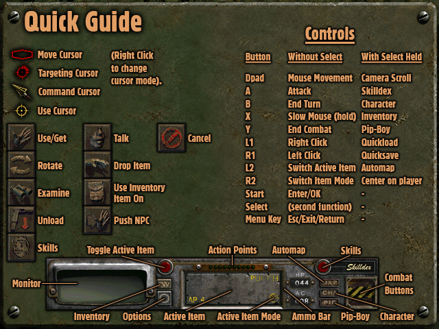

# Fallout 2 - Miyoo Mini Plus / OnionOS Port

This is a port of [**FOR:CE**](https://github.com/fallout2-ce/fallout2-ce) - the actively maintained
Fallout 2 community engine fork - to the **Miyoo Mini Plus** handheld running **OnionOS**.

Unlike a straightforward port of the original 1998 game, this build inherits everything FOR:CE offers:
native mod support (including the [Restoration Project](https://github.com/BGforgeNet/Fallout2_Restoration_Project)),
a built-in sfall-compatible scripting engine, dozens of quality-of-life settings, and many bug fixes over
vanilla Fallout 2 - all running natively on ARM, with a full D-pad/button control scheme and an on-device
text entry system for typing.

## OnionOS Exclusive Features

- Runs at full speed, no overclock needed
- Software rendering (the Miyoo Mini Plus has no 3D GPU)
- A full control scheme adapted for the Miyoo Mini Plus' hardware, which has no analog sticks
  (see [Controls](#controls))
- The D-pad acts as a mouse cursor
- A custom on-device text entry system (D-pad + buttons) for naming your character, save games,
  etc., since the device has no physical keyboard
- Working audio and video, including cutscenes

## Quality of life benefits over vanilla Fallout 2

- Party members can loot and barter in place of PC
- Directly equip party members instead of convincing them to use the right equipment
- Press L2, quickly, to move items when bartering, looting, or stealing, and auto-balance caps
- Music continues playing between maps
- Auto open doors
- Integrated "HELP" menu (with a Miyoo-specific control reference screen)

<p align="center">
  
  <br>
  <sub>The in-game "Quick Guide" help screen, replaced with the Miyoo Mini Plus control scheme</sub>
</p>

- Last used save slot is remembered
- You can cancel elevator floor selection using the Menu key
- Item/Corpse/Container/Critter highlighting
- Dozens of small things that just work a little better than they did in the original - better
  pathfinding, fewer graphics glitches, less finicky weapon stacking, and much more

> **Note:** A few FOR:CE features that require a screen wider/taller than 640x480 (the 2-column
> inventory, the 4-row barter screen, and other high-resolution UI layouts) are not available on this
> handheld's fixed resolution. Everything else works normally.

CE has broad (though not total) compatibility with [Sfall](https://github.com/sfall-team/sfall) scripting extensions. Many traditional Fallout mods work out of the box. See [SFALL_COMPATIBILITY.md](https://github.com/cacuracaptors/fallout2-ce-miyoomini/blob/main/SFALL_COMPATIBILITY.md) for the current compatibility status.

## Installation

1. Download the latest release from the [Releases page](https://github.com/cacuracaptors/fallout2-ce-miyoomini/releases).
2. Extract its contents to the root of your OnionOS SD card (this places `Fallout 2` in `Roms/PORTS/Games/`, and `Shortcuts` and `Imgs` in `Roms/PORTS/`).
3. You need your own legitimate copy of Fallout 2's data files. Copy these into the `Fallout 2` game
   folder on the SD card:
   - `master.dat`
   - `critter.dat`
   - `data/`

> **If you have a previous 1.0.0 release of this port installed:** delete all files from the old `Fallout 2` game folder first. That version was built on a different, unmaintained fork, and mixing
> old and new files will cause problems.

> **Important:** do not copy a `fallout2.cfg` from your own installation into the game folder, and
> delete one if it's already there. This port generates its own `fallout2.cfg` tuned for this
> hardware - overwriting it with a standard PC one will break the game.

## Installing with the Restoration Project (RPU) - optional

This port fully supports the [Restoration Project](https://github.com/BGforgeNet/Fallout2_Restoration_Project) mod, which restores a large amount of cut content - dozens of previously unused areas, quests, and
characters, new companions and expanded dialogue, and many bug fixes beyond what the base engine
already fixes.

> **Important:** if you install RPU on top of an existing save, or add it to this port after already
> starting to play, your old saves will not work correctly. **You must start a new game after
> installing RPU.** This isn't specific to this port - it's true of RPU on any platform.

To install it:

1. On a PC, install Fallout 2 normally.
2. Run the RPU installer on top of that same installation.
3. Copy **all** files from that installed folder into the `Fallout 2` game folder on your SD card,
   overwriting when prompted. This includes `master.dat`, `critter.dat`, `ce.dat`, `mods/`, `data/` -
   everything. Since it's hard to know in advance exactly which files RPU needs, copying everything over
   is the simplest way to make sure nothing is missing. As above, delete any `fallout2.cfg` that comes
   along with it.

You don't need to do anything else - this port automatically detects and uses RPU if it's present, and
works fine without it if you skip this section entirely. Other mods that don't rely on a Windows-only `ddraw.dll` (Nevada, Sonora, Party Orders, NPC Armor, and more) should work the same way: drop the mod's
files into the `mods/` folder and list it in `mods/mods_order.txt`.

## Configuring quality-of-life settings

Many of the improvements this fork adds over the original game (auto-opening doors, faster ammo
loading, and dozens more) are off by default and need to be turned on by editing `fallout2.cfg` by
hand, the same way you would on PC. Open `fallout2.cfg` in a text editor and change the value after
the `=` sign. For example, to enable auto-opening doors, find this line under the `[ui]` section:

```
auto_open_doors=0
```

...and change it to:

```
auto_open_doors=1
```

The same applies to most other settings in that file - `0` is off, `1` is on (a few settings use other
small numbers for different modes; more details in the [FOR:CE](https://github.com/fallout2-ce/fallout2-ce) repository.

## Controls

| Button   | Without Select                  | With Select held        |
| -------- | -------------------------------- | ------------------------ |
| D-pad    | Mouse movement                  | Camera scroll           |
| A        | Attack                          | Skilldex                |
| B        | End turn                        | Character               |
| X        | Slow mouse (hold)               | Inventory               |
| Y        | End combat                      | Pip-Boy                 |
| L1       | Right click                     | Quickload                |
| R1       | Left click                      | Quicksave                |
| L2       | Switch active item              | Automap                 |
| R2       | Switch item mode                | Center camera on player |
| Start    | Enter / OK                      | -                        |
| Select   | *(modifier)*                    | -                        |
| Menu key | Esc / Exit / Return / Open Menu | -                        |

The Menu key fires Esc on **release**, not on press - this means the OnionOS Menu+Power screenshot
combo won't accidentally exit the game before you can take a screenshot.

### Typing text (character name, save names, etc.)

Since the device has no keyboard, text entry works by cycling through letters directly in the game's
own text field, the same system used in our [Fallout (1997) port](https://github.com/cacuracaptors/fallout1-ce-miyoomini):

- **D-pad Up/Down**: cycles through the alphabet/numbers/space at the current position
- **D-pad Left**: toggles uppercase/lowercase for the current letter
- **D-pad Right**: inserts a space directly and moves to the next position
- **A**: confirms the current letter and moves to the next position
- **B**: deletes the last confirmed letter
- **Start**: confirms the whole text entry (Enter)
- **Menu key**: cancels the whole text entry (Esc)

A Miyoo-specific "Quick Guide" screen with this same control scheme (pictured above) is available from
the Options menu at any time in-game.

## Known issues

- The mouse cursor moves noticeably slower on screens with an open text field (character creation,
save/load naming, etc.). This one tracks down to the main fork too, so we'll have to deal with it for now.
- Sometimes, the game crashes when skipping intro videos quickly. Still under investigation.
- Also sometimes, controls get weird and some keys stop working or generating the wrong input. That's caused by a conflict with Restoration Project Updated (RPU), I'm still looking into it. For now, go to "Roms/PORTS/Games/Fallout 2/Mods/" and open "sfall-mods.ini". Right at the beggining, in [Highlighting], change "Key=42" to "Key=0" to disable item highlighting 'till I fix it.


## Changelog

- **v1.1.1** - Fixed an intermittent crash caused by an audio buffer over-read near the end of a
  sound buffer. Fixing this crash also eliminated the constant audio latency that was previously
  a known issue. Updated the Quick Guide help screen image.
- **v1.1.0** - Relaunched this port on top of the actively maintained FOR:CE fork (instead of the
  original, unmaintained fallout2-ce). Added Restoration Project (RPU) support, native mod
  support, a Miyoo-specific "Quick Guide" help screen, and dozens of quality-of-life settings
  inherited from FOR:CE.
- **v1.0.0** - Initial release, based on the original fallout2-ce fork.

## Building from source

This port requires cross-compiling for ARMv7 hard-float using a Docker-based toolchain. Tested
on Windows + WSL2 + Docker Desktop.

### Prerequisites

- WSL2 with Ubuntu, and Docker Desktop with WSL integration enabled.

### Steps

```
mkdir -p ~/fallout-miyoo && cd ~/fallout-miyoo

# Cross toolchain
git clone https://github.com/shauninman/union-miyoomini-toolchain.git

# SDL2 ported for the Miyoo Mini (Plus)
git clone https://github.com/steward-fu/sdl2.git sdl2-miyoo

# This repository (already patched)
git clone https://github.com/cacuracaptors/fallout2-ce-miyoomini.git fallout2-ce-new
```

**1) Build the Miyoo Mini SDL2** (inside `sdl2-miyoo`, via Docker - see the [steward-fu/sdl2](https://github.com/steward-fu/sdl2) instructions for the full `make cfg && make gpu && make sdl2` process). No patches are needed here - this port builds
against a completely unmodified copy of `steward-fu/sdl2`.

**2) Build fallout2-ce** using the cross toolchain:

```
cd union-miyoomini-toolchain
make shell
```

Inside the container, the bzip2 headers/symlink and git's `safe.directory` need to be set up once
per container session (the container is ephemeral, so this doesn't persist between runs):

```
ln -sf /opt/miyoomini-toolchain/arm-linux-gnueabihf/libc/usr/lib/libbz2.so.1.0.6 /opt/miyoomini-toolchain/arm-linux-gnueabihf/libc/usr/lib/libbz2.so
wget -O /opt/miyoomini-toolchain/arm-linux-gnueabihf/libc/usr/include/bzlib.h https://raw.githubusercontent.com/libarchive/bzip2/master/bzlib.h

git config --global --add safe.directory /root/workspace/fallout2-ce-new
```

Then configure and build:

```
cd ~/workspace/fallout2-ce-new

cmake -B build \
  -DCMAKE_TOOLCHAIN_FILE=toolchain-miyoomini.cmake \
  -DCMAKE_MODULE_PATH=$(pwd)/cmake_miyoo \
  -DCMAKE_BUILD_TYPE=Release \
  -DFALLOUT_VENDORED=OFF \
  -DSDL2_INCLUDE_DIR=/root/workspace/sdl2-miyoo/sdl2/include \
  -DSDL2_LIBRARY=/root/workspace/sdl2-miyoo/sdl2/build/.libs/libSDL2.so \
  -DCMAKE_EXE_LINKER_FLAGS="-Wl,--allow-shlib-undefined" \
  -DCMAKE_CXX_STANDARD_LIBRARIES="-lstdc++fs"

cmake --build build -j4 --target fallout2-ce
```

(`-lstdc++fs` has to go through `CMAKE_CXX_STANDARD_LIBRARIES`, not `CMAKE_EXE_LINKER_FLAGS`, because
GCC 8's `std::filesystem` symbols need it placed after the object files on the link line, and
`CMAKE_CXX_STANDARD_LIBRARIES` is what CMake appends at the very end.)

The final ARM (armhf) binary `fallout2-ce` will be in `build/`.

### What this fork changes (compared to upstream fallout2-ce/fallout2-ce)

- **`src/dinput.cc`** - makes mouse "relative mode" initialization non-fatal (this device's SDL2
  build doesn't implement it, and this fork treats that failure as fatal by default) and adds
  D-pad-as-mouse-cursor movement.
- **`src/input.cc`** - the full physical-button-to-game-action remapping, the Select-modifier layer,
  the on-device text entry system, key-repeat debounce for this hardware's key delivery quirks, and
  makes the Menu key's Esc action fire on key-release instead of key-press (so the OnionOS Menu+Power
  screenshot combo doesn't exit the game before Power can be pressed) - all layered on top of, not
  replacing, this fork's own sfall key-hook system.
- **`src/debug.cc`** - `debugPrint()` only logged through `SDL_Log` in debug builds upstream, which
  meant this fork's own `showMessageBox()` calls (used for fatal startup errors) were silently
  swallowed in a release build, since this hardware's SDL2 driver doesn't implement message boxes
  either. Logging is now unconditional.
- **`data/art/intrface/helpscrn.frm`** (+ matching `.pal`) - a Miyoo Mini-specific replacement for
  the in-game "Quick Guide" screen (pictured above), shown in place of the PC keyboard reference this
  fork normally ships (or the one added by RPU, if installed) via this engine's `master_patches`
  folder, which always takes priority over both `master.dat` and any mod.
- **`toolchain-miyoomini.cmake`, `cmake_miyoo/FindSDL2.cmake`** - cross-compilation setup for this
  hardware's ARMv7 hard-float toolchain.

## Credits

- [fallout2-ce/fallout2-ce (FOR:CE)](https://github.com/fallout2-ce/fallout2-ce) by [FOR:CE Community Engine](https://github.com/fallout2-ce)
- Original [fallout2-ce](https://github.com/alexbatalov/fallout1-ce) by [Alexander Batalov](https://github.com/alexbatalov)
- [Restoration Project (RPU)](https://github.com/BGforgeNet/Fallout2_Restoration_Project) by the [BGforgeNet community](https://github.com/BGforgeNet)
- Miyoo Mini Plus custom SDL2 driver by [Steward Fu](https://github.com/steward-fu)
- Miyoo Mini toolchain by [Shaun Inman ](https://github.com/shauninman)
- Original Fallout 2 (1998) by Interplay Entertainment / Black Isle Studios

## License

The source code in this repository is available under the [Sustainable Use License](https://github.com/cacuracaptors/fallout2-ce-miyoomini/blob/main/LICENSE.md).
